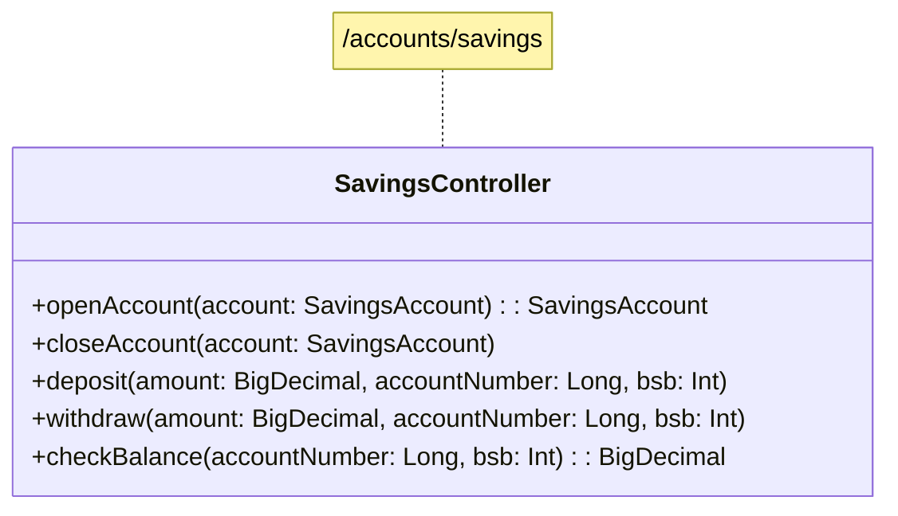

# Architecture

The Shine Bank is built using a 3-tier architecture:

- Controller
- Service
- Repository

The application will be built in stages:

## Stage 1 - Single-Module Monolith
The application will be built using the Spring Framework. 

## Stage 2 - Multi-Module Monolith
The application will add more functionality using a new gradle module.

## Stage 3 - Multi-Module Microservices
The application will be split into multiple microservices, using Quarkus or Spring

## Stage 4 - Multi-Module Macroservices
The microservices will be combined into 