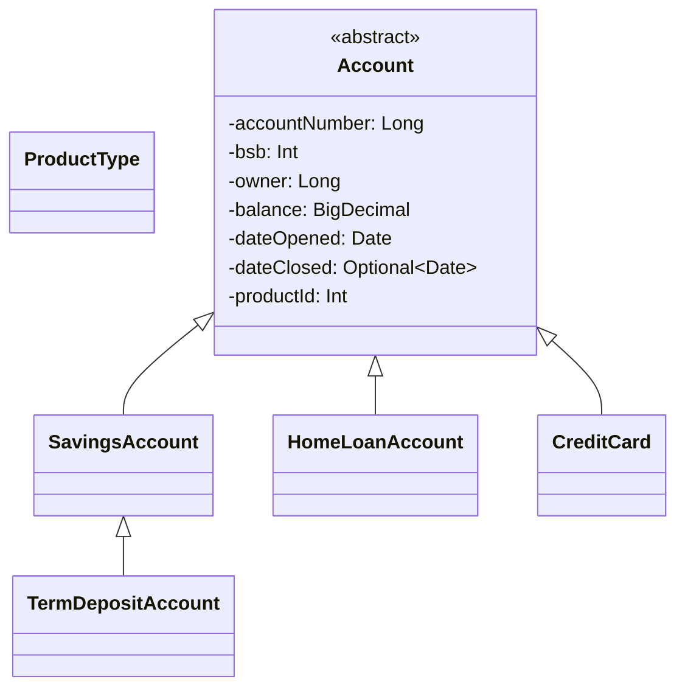
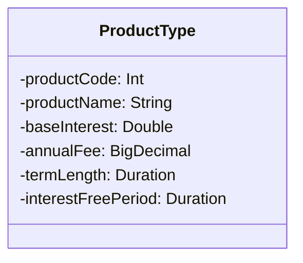
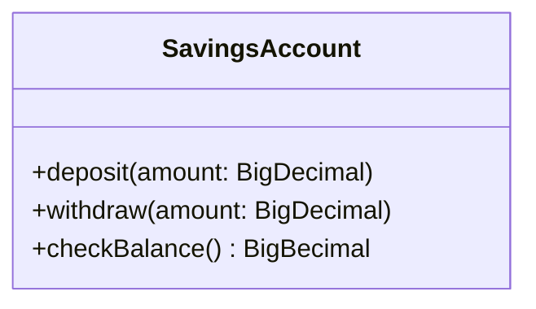
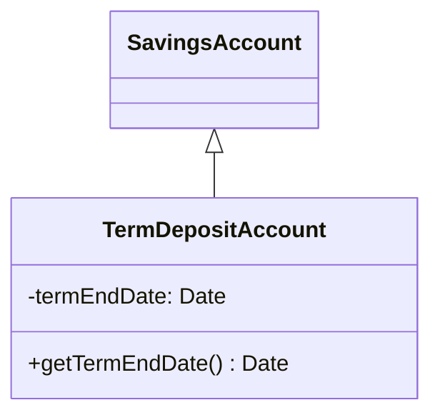
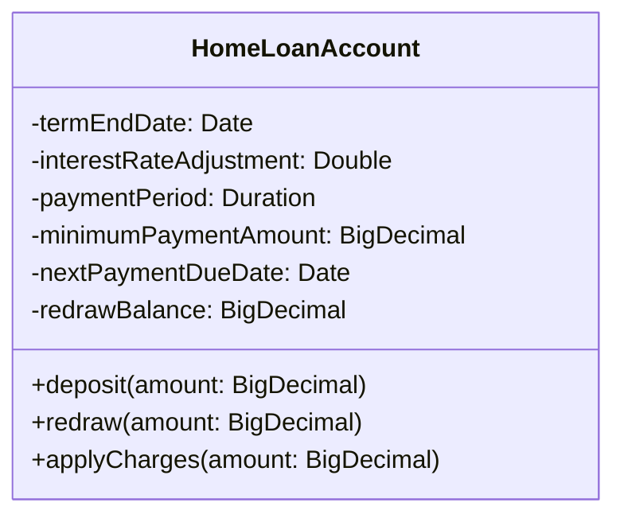
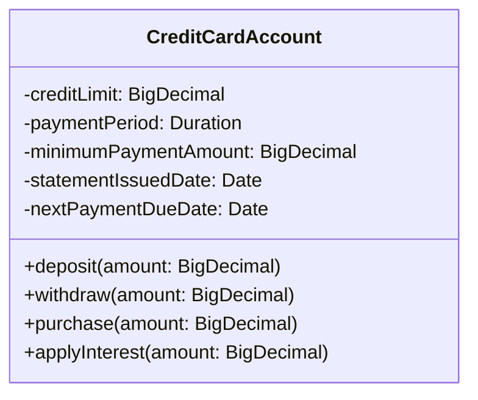

# Domain

The basic hierarchy of the classes is shown below

## `ProductType`

The `ProductType` gives a central location for creating business rules for each account.
Such rules include:

- setting the base interest rate for an account
- setting any annual fees for an account
- setting the term for an account
- setting the interest free period on purchases for a credit card, usually in days

## `Account`

The `Account` class is an abstract class that combines the basic features of an account of all the concrete account types.

- The combination of a `bsb` and `accountNumber` will uniquely identify an account between all of the banks.
- The `accountNumber` will uniquely identify an account within the Shiny Bank
- The `owner` refers to the `Customer` record that owns this account.
- The `balance` contains the account's balance, the money available. If this value is negative, the value has been borrowed, eg: HomeLoan & CreditCard.
- The `dateOpened` field contains the date when the account was opened.
- The `dateClosed` field contains the date when the account was closed.
- The `productId` refers to the `ProductType`, which contains further rules on the account.

## Debit types

Debit account types will use a person's money to deal with transactions.

### `SavingsAccount`

This is a simple savings account that allows a person to:

- deposit money
- withdraw money
- check their balance

### `TermDepositAccount`

This is a more complex savings account that allows customers to deposit money, but not withdraw for a fixed period.
Each deposit will restart the term in which the customer may not withdraw their money. 
During this period, the account will accrue a high-yield interest rate.
The user may only withdraw money _after_ the _term_ has ended.

In the case of a `TermDepositAccount`, this would include the term length and the interest rate.

## Credit types

Credit account types will use the bank's money to deal with transactions.

### `HomeLoanAccount`

This account allows a customer to borrow large quantities of money to be able to buy a house.
Usually, the interest rates are substantially smaller than a credit card or a personal loan.

| Field                    | Description                                                                                                                                                                           |
|--------------------------|---------------------------------------------------------------------------------------------------------------------------------------------------------------------------------------|
| `termEndDate`            | The date that the loan must be repaid by.                                                                                                                                             |
| `interestRateAdjustment` | The discount applied to this account on the base interest rate applied to the product. The combination of the product's base rate and the adjustment is the customer's interest rate. |
| `paymentPeriod`          | The frequency that the customer will make payments to the loan.                                                                                                                       |
| `paymentAmount`          | The minimumAmount that a customer must pay to meet the payment schedule and pay off the loan in time.                                                                                 |
| `nextPaymentDueDate`     | The date the next payment is due.                                                                                                                                                     |
| `redrawBalance`          | The amount of money that has been paid above the minimum payment amount, that is collected and can be withdrawn (or _redrawn_) by the customer.                                       |

- The `applyCharges()` method affects the balance of the loan.
- The `deposit()` method affects the balance, and any payment _over_ the `minimumPaymentAmount` will add to the `redrawBalance`.
- The `redraw()` method will allow the customer to withdraw only the amount that is in redraw, but this will also affect the balance of the loan.

### `CreditCardAccount`

A credit card will allow a user to use a pre-approved amount the bank's money as if it was their own.
Credit cards usually incur high interest rate charges, but also offer an interest free period on purchases.
Withdrawing cash from a credit card will incur interest immediately.

